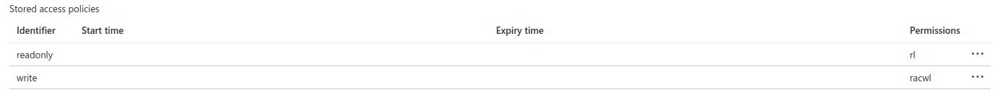

# Azure Documentation

## Server Setup

### Storage Container Setup
Assuming you have a storage account already created inside a resource group
in Azure, create a container called `data`. 

Upload a sentinel object into the container. This can be a small text file that
score will use to validate connectivity to the object storage at request time. 

Create access policies on the storage container. One for read operations and one
for write operations. 
Example:


Configure the score server either in the config file or env vars:

```yml
object:
  sentinel: <object_name> # name of the sentinel object you upoaded

azure:
  endpointProtocol: https
  accountName: <storage_account_name>
  accountKey: <storage_account_secret_key>

bucket:
  name.object: data # container name
  policy.upload: <write_policy> # name of the policy for the write/add/modify operations
  policy.download: <read_policy> # name of policy for the read/list operations

download:
  partsize: 250000000 # safe default
```

Start the server with the following run profiles enabled: `prod,secure,azure`

## Client Setup
Follow the regular client setup of access token and storage and metadata urls.
However when running the client use azure pofile option:
```bash
$ bin/score-client --profile azure ...
```