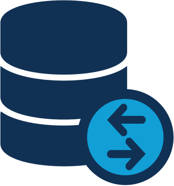

# Score - Genomic File Transfer & Object Storage Microservice

The volume, velocity, and variety of genomics data have risen dramatically, making on-premise computing and storage insufficient and cloud collaboration more appealing. However, researchers need specialized software tools to efficiently manage these large and complex data sets in the cloud. [Score](https://www.overture.bio/documentation/score/) addresses this by facilitating the efficient transfer and storage of genomics data between users in a distributed cloud network.

<!--Blockqoute-->

 

> 
> 

> 
> 

> 
> *Score is a vital service within the [Overture](https://www.overture.bio/) research software ecosystem. With our genomics data management solutions, scientists can significantly improve the lifecycle of their data and the quality of their research. See our [related products](#related-products) for more information on what Overture can offer.*
> 
> 

<!--Blockqoute-->

## Technical Specifications

- Written in JAVA 
- Supports AWS S3, Azure, Google Cloud, Openstack with Ceph, Minio and all other S3-compliant cloud storage solutions
- Built-in [Samtools](http://www.htslib.org/) functionality including BAM and CRAM file slicing by genomic region 
- ACL security using [OAuth 2.0](https://oauth.net/2/) and scopes based on study codes
- Multipart Uploads and Downloads
- REST API with [Swagger UI](https://swagger.io/tools/swagger-ui/)
- [MD5sum](https://www.intel.com/content/www/us/en/support/programmable/articles/000078103.html) validation

## Documentation

- See our Developer [wiki](https://github.com/overture-stack/score/wiki)
- For our user installation guide see our website [here](https://www.overture.bio/documentation/score/installation/installation/)
- For user guidance see our website [here](https://www.overture.bio/documentation/score/user-guide/admin-ui/)

## Support & Contributions

- Filing an [issue](https://github.com/overture-stack/score/issues)
- Making a [contribution](CONTRIBUTING.md)
- Connect with us on [Slack](http://slack.overture.bio)
- Add or Upvote a [feature request](https://github.com/overture-stack/score/issues?q=is%3Aopen+is%3Aissue+label%3Anew-feature+sort%3Areactions-%2B1-desc)

## Related Products 

  

Overture is an ecosystem of research software tools, each with narrow responsibilities, designed to address the adapting needs of genomics research. 

Score commonly works in tandem with our metadata service, [Song](https://github.com/overture-stack/SONG). As Score facilitates object storage in the cloud, Song runs in parallel to validate and track files and associated metadata. 

These tools are part of the Overture **Data Management System** (DMS), a fully functional and customizable data portal built from a packaged collection of Overtures microservices. For more information on DMS, read our [DMS documentation](https://www.overture.bio/documentation/dms/).

See the links below for additional information on our other research software tools:

 

|Product|Description|
|---|---|
|[Ego](https://www.overture.bio/products/ego/)|An authorization and user management service|
|[Ego UI](https://www.overture.bio/products/ego-ui/)|A UI for managing EGO authentication and authorization services|
|[Score](https://www.overture.bio/products/score/)| Transfer data quickly and easily to and from any cloud-based storage system|
|[Song](https://www.overture.bio/products/song/)|Catalog and manage metadata of genomics data spread across cloud storage systems|
|[Maestro](https://www.overture.bio/products/maestro/)|Organizing your distributed data into a centralized Elasticsearch index|
|[Arranger](https://www.overture.bio/products/arranger/)|Organize an intuitive data search interface, complete with customizable components, tables, and search terms|