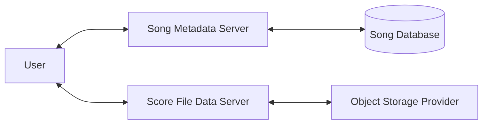

# Overview

Score is a file transfer service designed for cloud-based projects, providing a robust API for secure file transfer and storage operations. It serves as an intermediary between object storage systems and user authorization mechanisms, using pre-signed URLs for efficient and protected data access.

## Key Features

- **Multi-cloud Support**: Compatible with AWS S3, Azure Storage, and Google Cloud Storage
- **High-performance Transfers**: Implements multipart uploads and downloads for optimal throughput
- **Genomic Data Handling (SamTools)**: Supports BAM/CRAM file slicing by genomic region and provides built-in samtools operations for BAM file handling
- **Data Integrity**: Ensures file integrity through MD5 checksum validation on uploads and downloads
- **Security**: Implements ACL-based security using OAuth2 with study code-scoped access
- **Metadata Integration**: Integrates with the Song metadata management system for comprehensive data tracking
- **API**: Exposes a RESTful API with Swagger documentation for easy integration
- **File Bundling**: Enables efficient transfer of multiple files in a single bundle
- **Resumable Downloads**: Supports resuming downloads after network interruptions
- **FUSE Support**: Offers file system in Userspace (FUSE) support for enhanced file operations

## System Architecture

Score's primary function is to broker authenticated access to your object storage provider. It achieves this by:

1. Validating user access rights against an authorization system (Keycloak)
2. Generating time-limited pre-signed URLs for object access
3. Facilitating secure data transfer between clients and object storage

Score specializes in data transfer, while its companion application, Song, manages metadata independently from object storage concerns. 



For more detailed information on data flow and common processes see our usage section


## Repository Structure

```
.
├── /score-client
├── /score-core
├── /score-fs
├── /score-server
└── /score-test
```

#### Score-client

[Explaination]

#### Score-core

[Explaination]

#### Score-fs

[Explaination]

#### Score-server

[Explaination]

#### Score-test

[Explaination]
