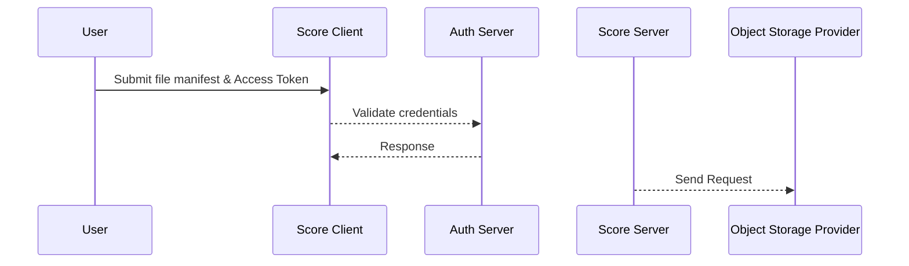
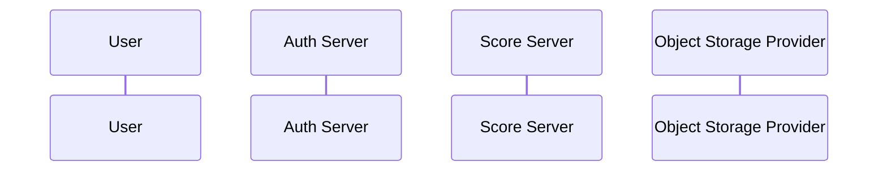

# Usage 

[Explaination of general workflow for download]

```mermaid
sequenceDiagram
    participant U as User
    participant SC as Score Client
    participant AS as Auth Server
    participant SS as Score Server
    participant OS as Object Storage Provider

    U->>SC: Submit file manifest & Access Token
    SC-->>AS: Validate credentials
    AS-->>SC: Response 
    SS-->>OS: Send Request
```

[Explaination of general workflow for submission]

```mermaid
sequenceDiagram
    participant U as User
    participant AS as Auth Server
    participant SCS as Score Server
    participant OS as Object Storage Provider
```

